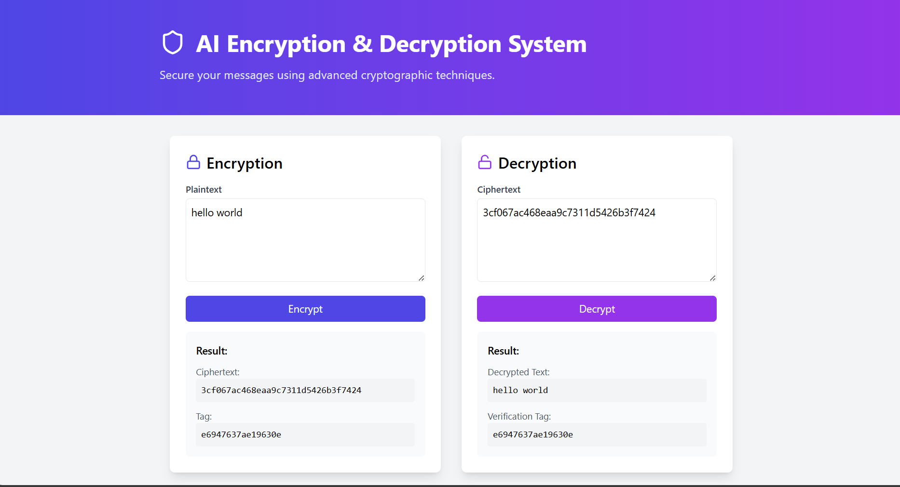
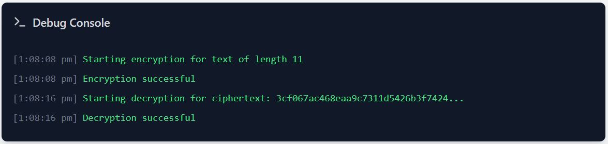
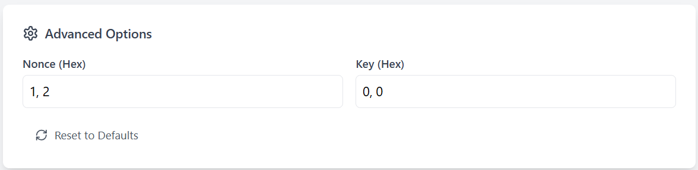

# 🔐 AI Encryption & Decryption System

[](https://reactjs.org/)
[](https://www.typescriptlang.org/)
[](https://vitejs.dev/)
[](https://tailwindcss.com/)
[](LICENSE)

> **Secure your messages with cutting-edge cryptographic technology** 🚀

---

## 📋 Table of Contents
- [Overview](#-overview)
- [Live Demo](#-live-demo)
- [Core Features](#-core-features)
- [Getting Started](#-getting-started)
- [Technologies](#-technologies)
- [Contributing](#-contributing)

---

## 🎯 Overview

**AI Encryption & Decryption System** is a state-of-the-art web application that empowers users to securely encrypt and decrypt messages using advanced cryptographic techniques. Built with modern web technologies and featuring an intuitive interface, this application provides real-time feedback, comprehensive debugging tools, and advanced customization options for cryptography enthusiasts.

> **Note:** The frontend was developed with the assistance of **Bolt New**, an AI-powered coding assistant that accelerates modern web development.

### ✨ Key Highlights
- 🔒 **Military-grade encryption** algorithms
- 🎨 **Modern, responsive UI** built with help from Bolt New AI
- 🔍 **Real-time debug console** for transparency
- ⚙️ **Advanced cryptographic parameters** customization
- 🚀 **Lightning-fast** encryption/decryption
- 📱 **Cross-platform compatibility**

---

## 🖥️ Live Demo

<div align="center">
  
  <br/>
  <sub><strong>🎨 Landing Page:</strong> A sleek, modern interface introducing the AI Encryption & Decryption System with intuitive navigation and professional design.</sub>
  <br/>
  
  <br/>
  <sub><strong>🔍 Debug Console:</strong> Real-time operational logs showing encryption/decryption status, success messages, and error handling for complete transparency and troubleshooting capabilities.</sub>
  <br/><br/>
  
  <br/>
  <sub><strong>⚙️ Advanced Options:</strong> Professional-grade cryptographic parameter customization. Set custom Nonce and Key values in hexadecimal format with one-click reset functionality.</sub>
</div>

---

## 🚀 Core Features

### 🔒 **Encryption Engine**
- **Instant Encryption**: Transform plaintext into secure ciphertext in milliseconds
- **Verification Tags**: Built-in integrity checking with cryptographic verification
- **Advanced Algorithms**: State-of-the-art cryptographic protocols
- **Real-time Feedback**: Immediate status updates and success confirmations

### 🔓 **Decryption System**
- **Secure Recovery**: Safely decrypt ciphertext back to original plaintext
- **Integrity Verification**: Automatic verification using cryptographic tags
- **Error Handling**: Comprehensive error detection and user feedback
- **Batch Processing**: Support for multiple decryption operations

### 🛠️ **Advanced Configuration**
- **Custom Parameters**: Set custom Nonce and Key values in hexadecimal
- **Professional Tools**: Advanced options for cryptography experts
- **Reset Functionality**: One-click restoration to default settings
- **Parameter Validation**: Real-time validation of cryptographic inputs

### 🖥️ **Debug Console**
- **Live Monitoring**: Real-time logs of all cryptographic operations
- **Status Tracking**: Detailed success, failure, and operational metrics
- **Transparency**: Complete visibility into encryption/decryption processes
- **Troubleshooting**: Comprehensive debugging tools for developers

---

## 🛠️ Getting Started

### 📋 Prerequisites
- **Node.js** (v18 or higher recommended)
- **npm** (v8 or higher)
- **Modern web browser** (Chrome, Firefox, Safari, Edge)

### ⚡ Quick Start

1. **Clone the repository**
   ```bash
   git clone <your-repo-url>
   cd "Ai Encryption and Decryption system/project"
   ```

2. **Install dependencies**
   ```bash
   npm install
   ```

3. **Launch the application**
   ```bash
   npm run dev
   ```

4. **Open your browser** and navigate to [http://localhost:5173/](http://localhost:5173/)

### 🔧 Development Commands
```bash
# Start development server
npm run dev

# Build for production
npm run build

# Preview production build
npm run preview

# Run linting
npm run lint
```

---

## 🛡️ Technologies

| Technology | Version | Purpose |
|------------|---------|---------|
| **React** | 18.3.1 | Frontend framework |
| **TypeScript** | 5.5.3 | Type-safe development |
| **Vite** | 5.4.2 | Build tool & dev server |
| **Tailwind CSS** | 3.4.1 | Styling framework |
| **Bolt New (AI)** | Latest | AI-powered coding assistant for frontend |

---

## 🤝 Contributing

We welcome contributions! Here's how you can help:

1. **Fork the repository**
2. **Create a feature branch** (`git checkout -b feature/amazing-feature`)
3. **Commit your changes** (`git commit -m 'Add amazing feature'`)
4. **Push to the branch** (`git push origin feature/amazing-feature`)
5. **Open a Pull Request**

### 📝 Development Guidelines
- Follow TypeScript best practices
- Maintain code quality with ESLint
- Write meaningful commit messages
- Test thoroughly before submitting

---

## 📄 License

This project is licensed under the **MIT License** - see the [LICENSE](LICENSE) file for details.

---

<div align="center">
  <strong>🔐 Secure • Fast • Reliable</strong>
  <br/>
  <em>Built with ❤️ using modern web technologies and the help of Bolt New AI</em>
</div>

> _For any questions or contributions, feel free to open an issue or pull request!_
